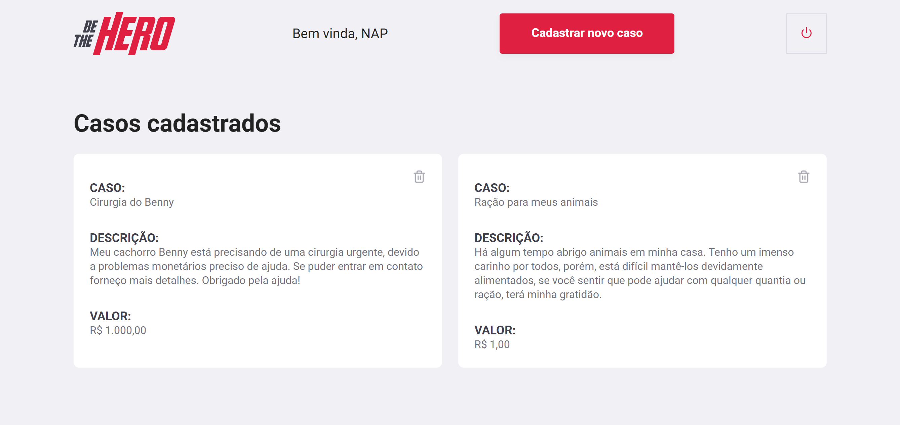
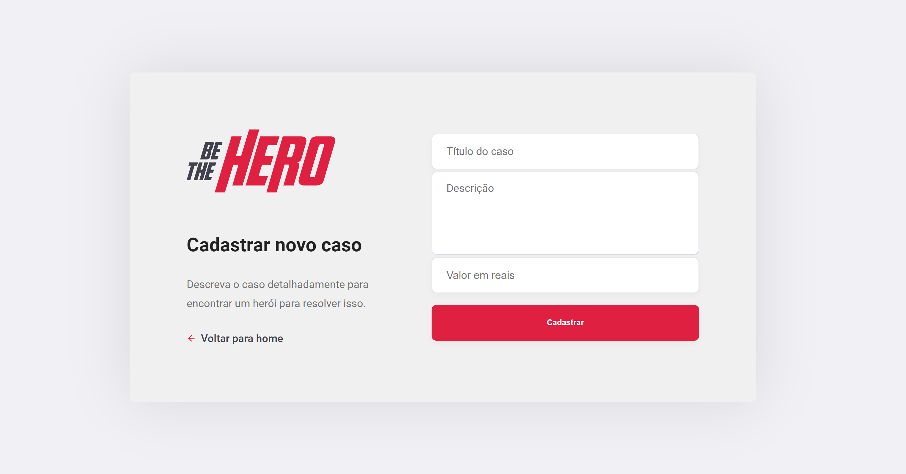
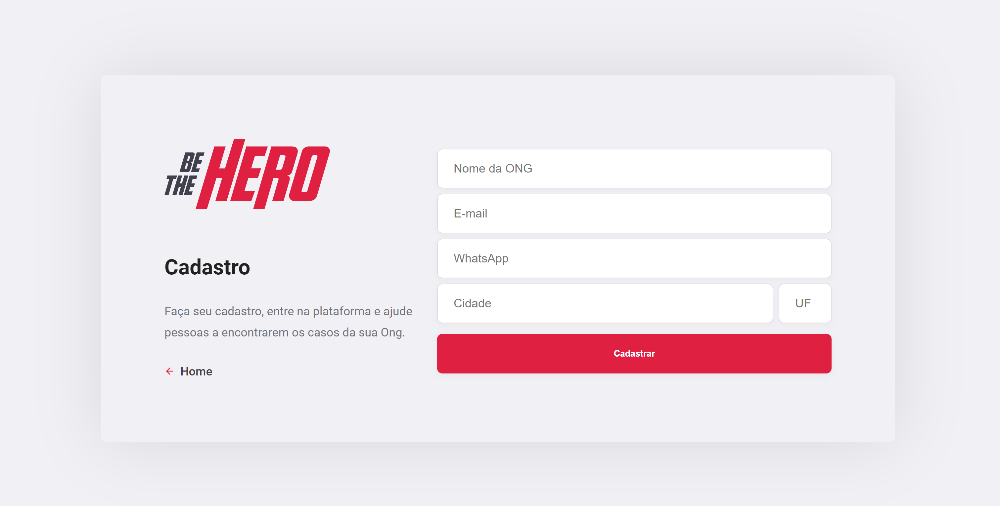

<h1 align="center">
   
</h1>
  
<h2 align="center">
   The purpose from Be The Hero is to be a platform when users can create local ONGs to register cases and search for people to help.
</h2>

  

 
  

## About OmniStack Week 

The OmniStack Week was a [Rocketseat](https://rocketseat.com.br/)'s event that we build App from zero using JavaScript . I saw this event months later, even so all the concepts that I learned in this class helped me to know more about JS and be a better coder.
  
Thanks Rocketseat :purple_heart: and [Diego Fernandes](https://github.com/diego3g).

[Layout](https://www.figma.com/file/2C2yvw7jsCOGmaNUDftX9n/Be-The-Hero---OmniStack-11?node-id=0%3A1) da aplicação no  Figma.

  

## Screenshots :camera_flash:	

  
  
  
  

  
    
## Techs :rocket:
- ReactJS 
- NodeJS 
- SQLite 
    
  
   
## Author :man_technologist:	

- GitHub: [nikolaslopes](https://github.com/nikolaslopes) :octocat:
- LinkedIn: [nikolas-lopes](https://www.linkedin.com/in/nikolas-lopes-b06524209/) :shipit:

 
  

Thanks for your support :mage_man:

