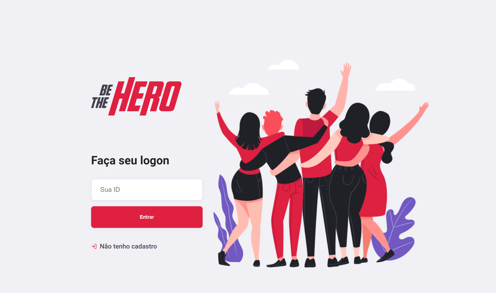

<h1 align="center">
   
</h1>
  
<h2 align="center">
   The purpose from Be The Hero is to be a platform when users can create local ONGs to register cases and search for people to help.
</h2>
 
   

## About OmniStack Week :rocket:

The OmniStack Week was a [Rocketseat](https://rocketseat.com.br/)'s event that we build App from zero using JavaScript . I saw this event months later, even so all the concepts that I learned in this class helped me to know more about JS and be a better coder. 

   

## Screenshots :camera_flash:	

  
  
  
  

   

### :partying_face::rocket:Thanks Rocketseat:rocket::partying_face:

 
    
# Techs :rocket:
- React 

- Swiper API
- Scroll Reveal API
- Icon Moon Generator
    
  
   
# 👨🏻‍💻 Author

- GitHub: [nikolaslopes](https://github.com/nikolaslopes) :octocat:
- LinkedIn: [nikolas-lopes](https://www.linkedin.com/in/nikolas-lopes-b06524209/) :shipit:

   
  

Thanks for your support :mage_man:

